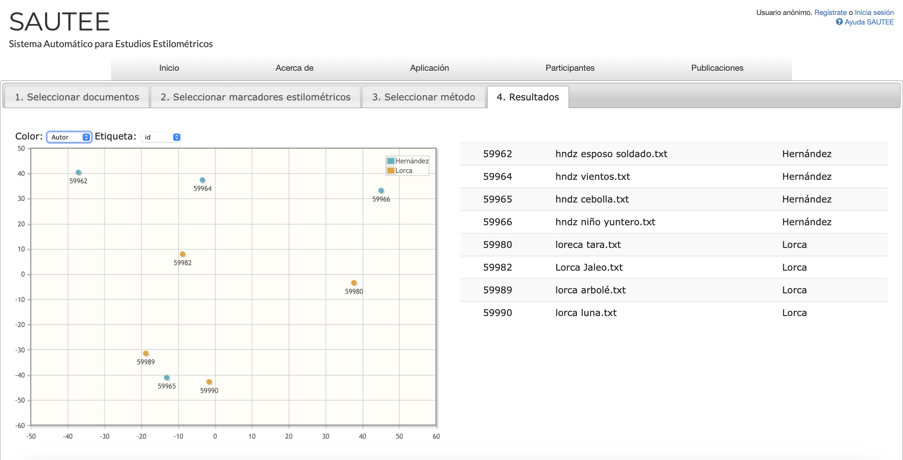

# Reporte de Comparación Estilométrica entre Miguel Hernández y Federico García Lorca usando SAUTEE

## 1. Introducción

El análisis estilométrico permite identificar patrones estilísticos característicos en los textos de distintos autores mediante técnicas cuantitativas. En este reporte se emplea el sistema **SAUTEE (Sistema Automático para Estudios Estilométricos)** para comparar la escritura de **Miguel Hernández** y **Federico García Lorca**, utilizando un conjunto representativo de textos literarios de cada uno.

---

## 2. Metodología

### 2.1. Corpus utilizado

Se analizaron ocho documentos en total, cuatro por autor:

| Autor            | Documento                                |
|------------------|------------------------------------------|
| Miguel Hernández | hndz esposo soldado.txt                  |
|                  | hndz vientos.txt                         |
|                  | hndz cebolla.txt                         |
|                  | hndz niño yuntero.txt                    |
| Federico G. Lorca| loreca tara.txt                          |
|                  | Lorca Jaleo.txt                          |
|                  | lorca arbolé.txt                         |
|                  | lorca luna.txt                           |

### 2.2. Características estilométricas seleccionadas

Se seleccionaron los siguientes **marcadores estilométricos** por su capacidad para capturar aspectos gramaticales y de estilo:

- **Longitud de oraciones**: puede reflejar complejidad sintáctica y ritmo.
- **Longitud de palabras**: útil para identificar riqueza léxica o simplicidad expresiva.
- **Unigramas de etiquetas POS**: permiten observar el tipo de palabras más frecuentes (sustantivos, verbos, etc.).
- **Razón de adjetivos**: relacionada con la descriptividad del estilo.
- **Razón de sustantivos**: indica densidad informativa.
- **Bigramas de etiquetas POS**: capturan secuencias gramaticales frecuentes que varían entre estilos.

Estas características fueron elegidas por su **capacidad para discriminar entre estilos poéticos distintos**, como el de Hernández (más directo y social) y el de Lorca (más simbólico y lírico).

---

## 3. Resultados

El gráfico obtenido muestra una **separación clara** entre los documentos de ambos autores:

- Los textos de **Miguel Hernández** (en azul) tienden a agruparse en el cuadrante superior izquierdo y derecho.
- Los textos de **Federico García Lorca** (en naranja) se agrupan principalmente en la parte inferior del plano.

| ID     | Documento                  | Autor     |
|--------|----------------------------|-----------|
| 59962  | hndz esposo soldado.txt    | Hernández |
| 59964  | hndz vientos.txt           | Hernández |
| 59965  | hndz cebolla.txt           | Hernández |
| 59966  | hndz niño yuntero.txt      | Hernández |
| 59980  | loreca tara.txt            | Lorca     |
| 59982  | Lorca Jaleo.txt            | Lorca     |
| 59989  | lorca arbolé.txt           | Lorca     |
| 59990  | lorca luna.txt             | Lorca     |

---

## 4. Análisis

El análisis revela **una diferenciación estilística significativa** entre ambos autores. Esta separación sugiere que los rasgos seleccionados permiten identificar de manera robusta diferencias de estilo como:

- **Hernández** utiliza oraciones de longitud más variable y posiblemente un estilo más directo y narrativo.
- **Lorca** emplea un lenguaje más simbólico, con una frecuencia mayor de adjetivos y estructuras poéticas recurrentes que se reflejan en los bigramas POS.

La distancia entre puntos del mismo autor también indica **variedad estilística interna**, especialmente en los textos de Lorca, que aparecen más dispersos que los de Hernández.

---